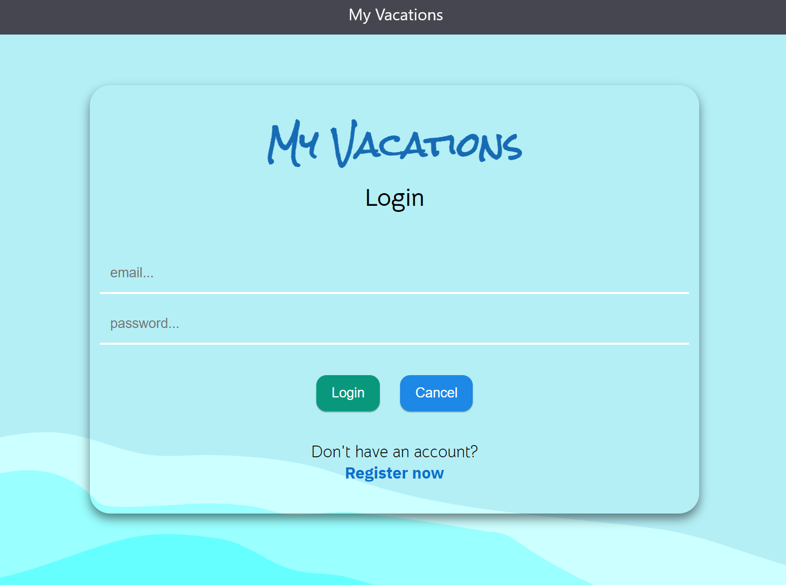

# My Vacations

Student's Full Stack Project. CRUD. Authentication. Separated admin panel.
__________________________________________________________________________________________________________________________________________________

SKILLS: 
· TypeScript 
· Cascading Style Sheets (CSS) 
· SQL 
· MySQL 
· HTML5
· Node.js 
· Vite.js 
· Redux.js 
· React.js 
· RTK query 
· JSON Web Token (JWT) 
· Bcrypt 
· Express.js 
· Mocha
· Chai
· Docker

SITE: http://vacations.stacey.co.il 
__________________________________________________________________________________________________________________________________________________

To get into the user interface functionality, register a new user and log in.
To get into the admin interface functionality, clone this project on my github: https://github.com/shomersaf/vacations
and start it on your docker with .
For cridentials: ask the author

___________________________________________________________________________________________________________________________________________________

PROJECT SCREENSHOTS:

On User's Logged In

On Admin's Logged In

_____________________________________________________________________________________________________________________________________________________

PROJECT DEMONSTRATING VIDEO
https://youtu.be/VzQyPIzElkI
______________________________________________________________________________________________________________________________________________________

PROJECT ARCHITECTURE SCHEME

